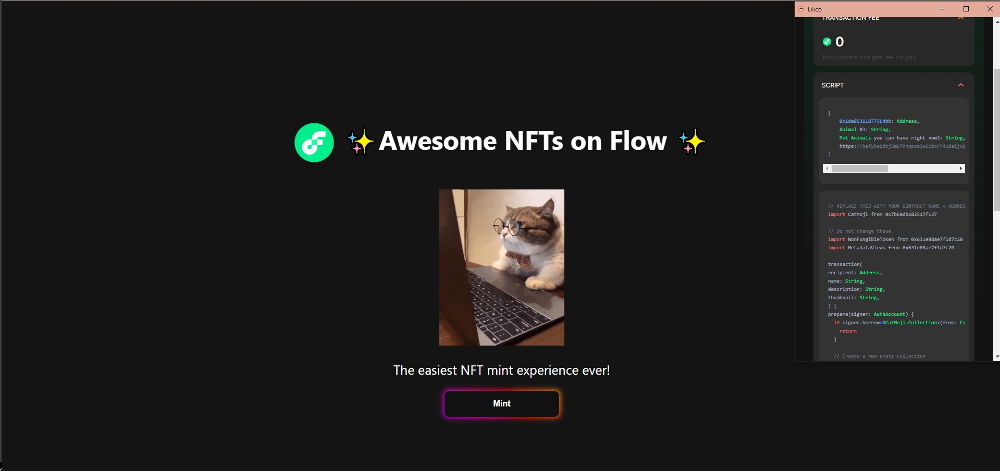

# Flow NFT Collection

CatMoji Frontend (Extended as Animal NFT)

<a href="https://flow-nft-mint.onrender.com/"> Hosted Site</a>
Note: Make sure you are on developer mode and pointing to testnet

### Technologies

### Backend Code
<a href="https://github.com/tashunc/FlowNFTs"> FlowNFT (Cadence Project) </a>

## Credits

Buildspace

## License

Project is [MIT licensed](./LICENSE).